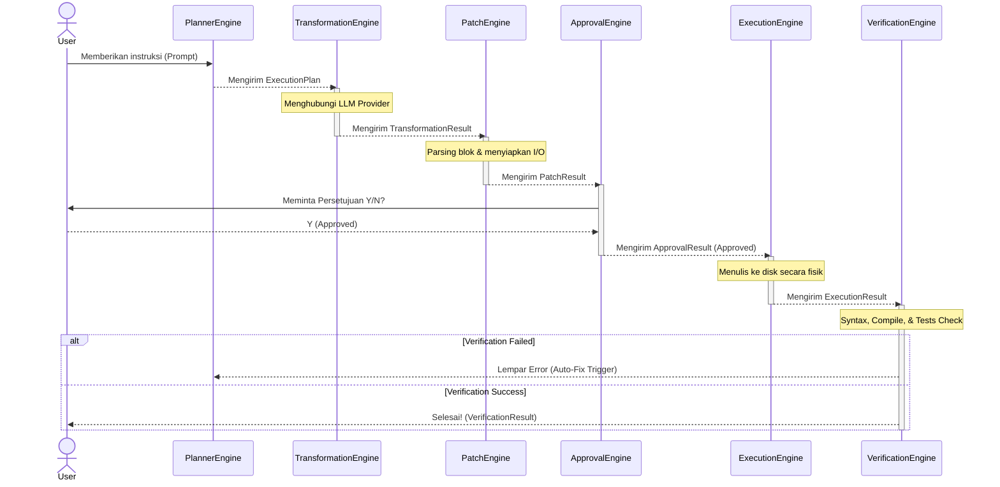
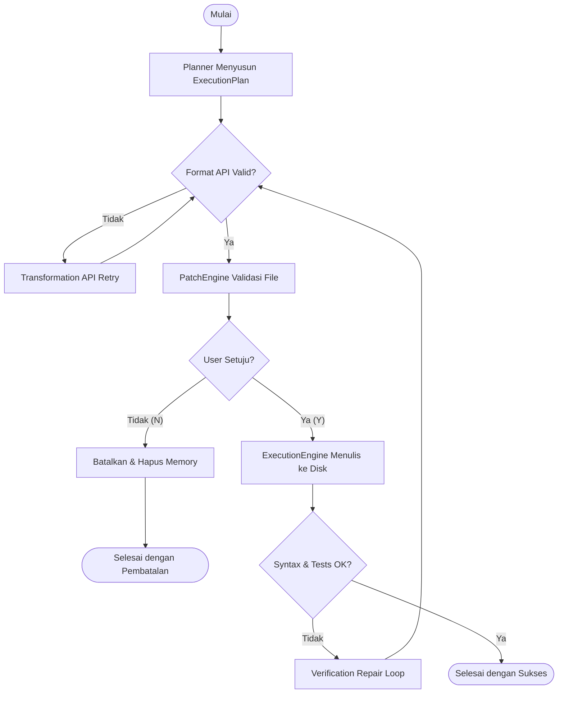
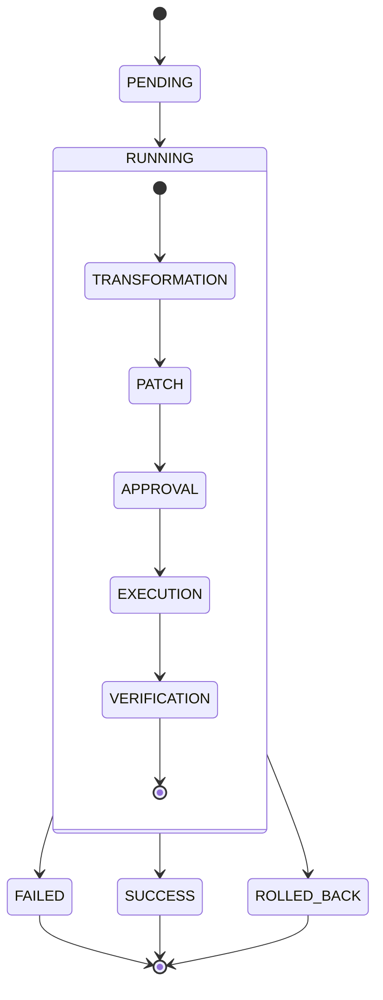

# State, Events, & Trifecta Diagrams

Banyak *developer* kesulitan memahami aliran eksekusi asinkron di dalam sistem berbasis AI. Dokumen ini adalah peta panduan utama untuk mengamati pergerakan data dari hulu ke hilir. 

Nexa memodelkan aliran operasinya ke dalam tiga diagram utama (*Trifecta Diagrams*) dan mengekspos setiap milestonenya melalui **Event Bus** yang terstandarisasi.

---

## 1. Sequence Diagram (Interaksi Antar Engine)

Diagram ini menunjukkan kronologi waktu nyata (*real-time*) bagaimana entitas-entitas utama berkomunikasi. Perhatikan kehadiran *Verification Engine* yang dapat melakukan *Auto-Fix* kembali ke *Planner*.



---

## 2. Activity Diagram (Alur Keputusan & Retry)

Activity Diagram berfokus pada titik percabangan (*decision points*). Terdapat dua jenis *Retry* yang berbeda secara logika:
1. **Transformation Retry:** Kegagalan koneksi API atau halusinasi format JSON.
2. **Verification Repair:** Kegagalan logika kode aktual (bug).



---

## 3. State Diagram (Transisi Status Generic)

Status Nexa dibuat generik di level atas agar antarmuka seperti *Remote Agent* dan Web mudah membaca status tanpa harus menghafal setiap fase. Fase spesifik dicatat di dalam substate `RUNNING`.



---

## 4. Event Bus Contract & EventContext

Nexa tidak memancarkan objek murni (`PatchResult`) ke pendengar (*subscriber*). Sebaliknya, setiap DTO dibungkus (*wrapped*) ke dalam **`EventContext`** agar *Plugin* selalu menerima meta-data yang konsisten.

### EventContext Wrapper
```python
@dataclass
class EventContext:
    event_name: str
    timestamp: str          # ISO 8601
    source_engine: str      # Planner, Transformation, Patch, Execution, Plugin
    priority: str           # HIGH, NORMAL, LOW
    session_id: str
    duration: float
    payload: Any            # DTO aktual (misal: PatchResult)
```

### Event List & Priority
Semua *event* yang dilempar oleh sistem ke dalam `EventManager`:

| Kategori | Event Name | Source | Priority | Payload DTO |
|---|---|---|---|---|
| **Session** | `SessionStarted` | Planner | NORMAL | `ExecutionPlan` |
| | `SessionCompleted` | Verification | NORMAL | `VerificationResult` |
| **Pipeline** | `BeforeTransformation` | Transformation | NORMAL | `ExecutionPlan` |
| | `AfterTransformation` | Transformation | NORMAL | `TransformationResult` |
| | `BeforePatch` | Patch | NORMAL | `TransformationResult` |
| | `AfterPatch` | Patch | NORMAL | `PatchResult` |
| | `BeforeApproval` | Approval | HIGH | `PatchResult` |
| | `AfterApproval` | Approval | NORMAL | `ApprovalResult` |
| | `BeforeExecution` | Execution | NORMAL | `ApprovalResult` |
| | `AfterExecution` | Execution | NORMAL | `ExecutionResult` |
| **Error/Failure** | `TransformationFailed` | Transformation | HIGH | `ErrorObject` |
| | `PatchFailed` | Patch | HIGH | `ErrorObject` |
| | `ExecutionFailed` | Execution | HIGH | `ErrorObject` |
| | `VerificationFailed` | Verification | HIGH | `VerificationResult` |
| **Retry** | `RetryStarted` | Any | LOW | `RetryInfo` |
| | `RetryCompleted` | Any | NORMAL | `RetryInfo` |
| **Rollback** | `RollbackStarted` | Execution | HIGH | `RollbackInfo` |
| | `RollbackCompleted` | Execution | HIGH | `RollbackInfo` |
| **Observability**| `MetricsCollected` | Plugin/Any | LOW | `Metrics` |

---

## 5. EventManager Contract (API)

Komponen inti yang mengorkestrasi pertukaran pesan di atas adalah `EventManager`. Semua *engine*, ekstensi VSCode, Bot Telegram, dan *Remote Agent* **wajib** menggunakan API ini.

### Interface Mandatory
```python
class EventManagerProtocol(Protocol):
    
    # Mendaftar sebagai pendengar (Synchronous atau Asynchronous callback diperbolehkan)
    def subscribe(self, event_name: str, callback: Callable[[EventContext], None]): ...
    
    # Mencabut pendaftaran
    def unsubscribe(self, event_name: str, callback: Callable[[EventContext], None]): ...
    
    # Melemparkan event secara Synchronous (Blocking)
    # Berguna untuk proses inti yang tidak boleh berlanjut sebelum event diproses.
    def publish(self, event: EventContext): ...
    
    # Melemparkan event secara Asynchronous (Non-Blocking / Fire-and-Forget)
    # Berguna untuk Telegram, Discord, UI Update agar tidak memperlambat eksekusi.
    def publish_async(self, event: EventContext): ...
    
    # Membersihkan seluruh subscriber (biasanya dipanggil saat teardown/session end)
    def clear(self): ...
```
