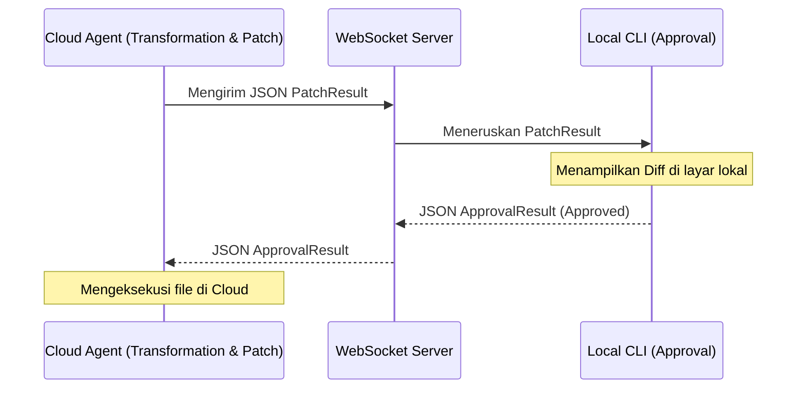

# Extensions & Visionary Integration (Phase 4 - 6)

Desain **Master Contract** yang sangat modular tidak hanya berguna untuk eksekusi CLI lokal di mesin Anda. Dokumen ini mendefinisikan *Plugin Contract* yang visioner, di mana sistem eksternal dapat mengambil kendali atau bereaksi terhadap Nexa.

---

## 1. Plugin Contract
Nexa mengizinkan injeksi fungsi eksternal asalkan fungsi tersebut menghormati *Lifecycle Event Bus*.

### Cara Kerja
Sebuah *Plugin* (misalnya `LinterPlugin` atau `NotificationPlugin`) dilarang memodifikasi langsung *internal state* milik `ExecutionEngine` atau `TransformationEngine`.
Mereka harus mendaftar (registrasi) sebagai **Event Listener**.

```python
# Contoh Kontrak Implementasi Plugin (Python)
class NexaPlugin:
    def get_name(self) -> str:
        pass
        
    def register_hooks(self, event_bus: EventManager):
        pass
```

Jika `NotificationPlugin` ingin memberi tahu *user* saat sebuah *patch* sukses, ia cukup melakukan:
```python
event_bus.subscribe("AfterExecution", self._send_notification)

def _send_notification(self, result: ExecutionResult):
    if result.success:
         # Panggil API Discord/Slack
         pass
```

---

## 2. Remote Agent (Phase 4)
Pada Phase 4, eksekusi Nexa mungkin berjalan di kontainer awan (*Cloud Docker Container*), namun meminta persetujuan CLI dari mesin lokal Anda. 

Karena *ExecutionPlan* dan *PatchResult* dikemas murni dalam JSON (seperti yang diwajibkan di `04_policies.md`), *Remote Agent* cukup men-*serialize* `PatchResult`, mengirimkannya via WebSockets, dan menunggu UI lokal Anda membalas dengan `ApprovalResult` JSON.



---

## 3. Telegram & Chat Interfaces (Phase 5)
Pada Phase 5, pengguna bisa memerintah Nexa dari HP melalui Telegram atau WhatsApp. Bot tidak perlu diprogram secara rumit dari nol.

Bot Telegram cukup bertindak sebagai *Dummy Interface* (Hanya UI).
- Saat *user* mengetik "Tambahkan fungsi login", Bot menyuntikkannya ke `PlannerEngine` sebagai `Prompt`.
- Bot men-*subscribe* `BeforeApproval` *event*. Saat *event* ini memicu, Bot mengirimkan pesan "Apakah Anda setuju mengubah `auth.py`? [Ya/Tidak]".
- Ketika pengguna memencet "Ya", Bot mengirim `ApprovalResult` kembali ke Nexa.

---

## 4. Autonomous Software Engineer (Phase 6)
Dalam puncak evolusi Nexa (Autonomous Mode), Nexa akan memprogram dirinya sendiri secara paralel.

Dalam mode ini, *Approval Engine* tidak lagi menanyakan *user*. Sebaliknya, ia digantikan oleh *AI Critic Engine* (sistem LLM lain yang bertugas sebagai *Senior Reviewer*).
1. `Transformation Engine` (Junior AI) menghasilkan `PatchResult`.
2. `Approval Engine` meneruskannya ke *Critic AI* (Senior AI).
3. Jika *Critic AI* setuju, ia mem- *bypass* *ApprovalResult* dengan `approved=True`.
4. Semuanya dilakukan secara terprogram berkat arsitektur berbasis *Contract*.
