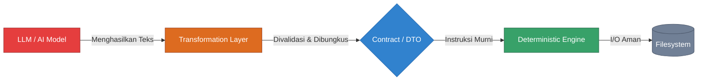
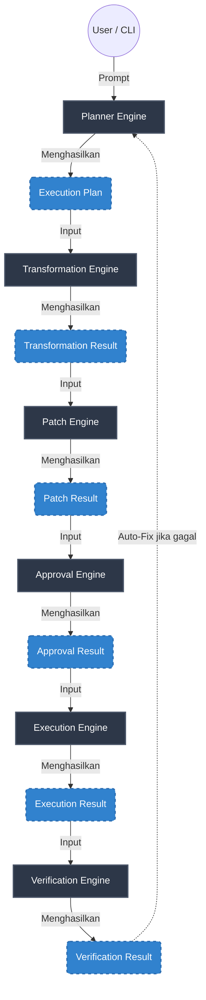
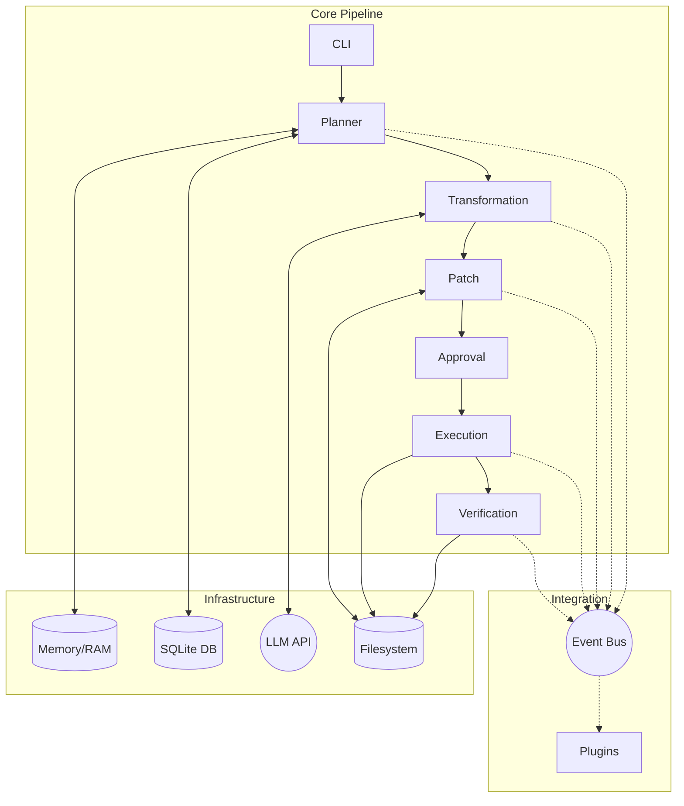
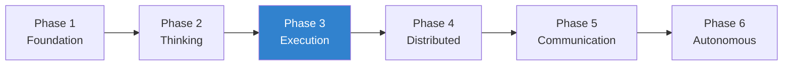

# Visual Reference Architecture (Bird's Eye View)

Dokumen ini adalah ringkasan mutlak. Jika Anda adalah developer baru yang merasa kewalahan dengan seluruh aturan, buka dokumen ini untuk melihat keseluruhan sistem Nexa dalam satu lembar gambar.

---

## 1. Architecture Principles (Prinsip Pembeda Nexa)

Inilah yang membedakan Nexa dari asisten *coding* biasa. AI **bukanlah** pengendali sistem, melainkan hanya salah satu lapisan (layer) transformasi. Tidak boleh ada kontak langsung antara LLM dan sistem operasi.



---

## 2. Full Pipeline Diagram (The Macro View)

Aliran utama perpindahan *Data Transfer Object* (DTO) antar *engine*.



---

## 3. Runtime Architecture Diagram

Bagaimana infrastruktur pendukung (*Infrastructure Layer*) seperti Database, Memory, dan LLM API berinteraksi selama *pipeline* berjalan.



---

## 4. Dependency Layer & Rules (Clean Architecture)

Nexa mematuhi asas *Clean Architecture*. Aturan utamanya adalah: **Layer di atas boleh mengimpor Layer di bawahnya, tetapi Layer bawah TIDAK BOLEH mengimpor Layer di atasnya**.

```mermaid
graph TD
    subgraph Layer 1: Interfaces (Plugins & CLI)
        CLI[Terminal CLI]
        Telegram[Telegram Bot]
        Remote[Cloud Agent]
    end

    subgraph Layer 2: Core Engines
        Planner[Planner]
        Transform[Transformation]
        Patch[Patching]
        Exec[Execution]
    end

    subgraph Layer 3: Contracts (The Immutable DTOs)
        DTO[Models & ExecutionPlan]
    end

    subgraph Layer 4: Providers & Infrastructure
        LLM[Groq/Ollama API]
        FS[File System]
    end

    Layer 1 -->|Boleh Mengakses| Layer 2
    Layer 2 -->|Boleh Mengakses| Layer 3
    Layer 2 -->|Boleh Mengakses| Layer 4
    Layer 4 -.-> |TIDAK BOLEH DIAKSES| Layer 2
```

---

## 5. Architecture Constraints (Dependency Matrix)

Untuk mencegah *Circular Dependency* dan *Spaghetti Code*, setiap *engine* dibatasi secara keras mengenai sumber daya apa yang boleh mereka impor (*import*) dan akses.

| Engine | Boleh Mengimpor & Mengakses | Keterangan Tambahan |
|---|---|---|
| **Planner** | `Contracts`, `KnowledgeEngine` | **TIDAK BOLEH** mengimpor `PatchEngine` atau menyentuh eksekusi fisik. |
| **Transformation** | `Contracts`, `Providers` (Groq/Ollama) | Satu-satunya *engine* yang boleh menyentuh LLM API. |
| **Patch** | `Contracts`, `Filesystem` | Dilarang keras mengimpor model LLM atau `Planner`. |
| **Approval** | `Contracts` | Murni logika bisnis persetujuan (Y/N). |
| **Execution** | `Contracts`, `Filesystem` | Tempat di mana *atomic file writing* terjadi. |
| **Verification** | `Contracts`, `Test Runner` / `AST` | Hanya untuk membaca kode dan menjalankan tes. |

---

## 6. Architecture Evolution (Roadmap)

Desain ini dibuat bukan tanpa alasan. Roadmap Nexa dibagi menjadi 6 fase evolusi, di mana Master Contract ini dibangun untuk mempersiapkan sistem memasuki *Phase 4* hingga *Phase 6*.



- **Phase 1 (Foundation):** CLI dasar, struktur *project*, integrasi Provider LLM.
- **Phase 2 (Thinking):** Pemahaman *Context*, *Knowledge Engine*, RAG.
- **Phase 3 (Execution):** *Transformation Engine*, *Patch Engine*, dan pembuatan Master Contract ini.
- **Phase 4 (Distributed):** *Remote Agent*, pemisahan *client* lokal dan komputasi awan.
- **Phase 5 (Communication):** Integrasi *third-party* (Telegram, VSCode Plugin, Slack).
- **Phase 6 (Autonomous):** Penghapusan campur tangan manusia (mode AI Agent otonom dengan *Critic AI*).
