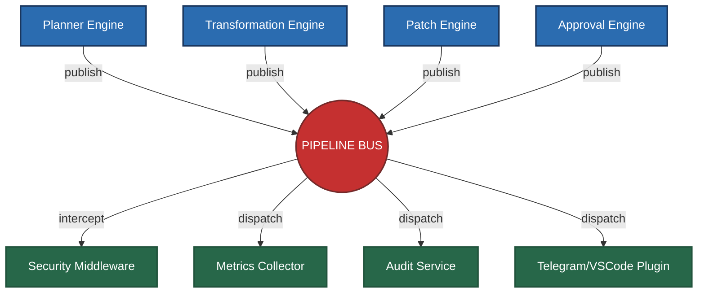
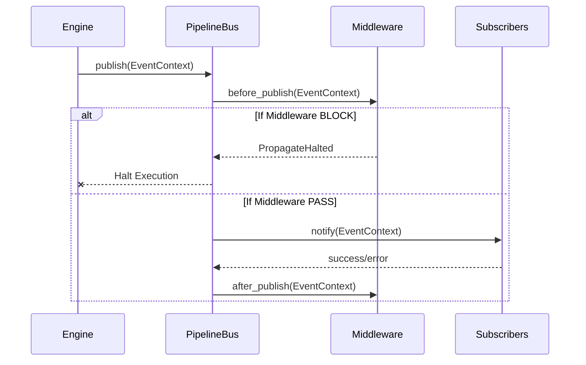

# Infrastructure Layer Architecture (Phase 3.35)

Dokumen ini adalah spesifikasi arsitektur absolut untuk **Core Infrastructure Layer** (Phase 3.35). Lapisan ini bertindak sebagai tulang punggung eksekusi (*Execution Spine*) bagi seluruh komponen Nexa. Komponen apa pun di fase-fase berikutnya (Approval, Execution, Verification, Remote Agent) **wajib** menggunakan infrastruktur ini tanpa mendesain ulang fondasi komunikasi.

---

## 1. Konsep Utama: PipelineBus (The Execution Spine)

Di Nexa, infrastruktur komunikasi tidak menggunakan sekadar *Event Bus* tradisional, melainkan **PipelineBus**.
Semua komponen terisolasi secara total dan hanya berkomunikasi via `EventContext` melalui jembatan *PipelineBus*.

### Visualisasi Topologi (Execution Spine)



---

## 2. EventContext (DTO Standard)

Semua pergerakan data dibungkus dalam entitas `EventContext` tunggal yang diperkaya:

### Fields
- `id` (String, UUID unik)
- `correlation_id` (String) - **Krusial:** Identitas penelusuran. Tetap sama dari `BeforeTransformation` hingga `AfterExecution`.
- `session_id` (String)
- `timestamp` (DateTime)
- `event_name` (String)
- `priority` (Enum: LOW, NORMAL, HIGH)
- `source` (String) - Siapa yang melempar event (misal: "PatchEngine")
- `payload` (Dict/Any)
- `metadata` (Dict)

---

## 3. Middleware Pipeline (Object-Oriented)

*PipelineBus* mendukung penyisipan **Middleware**. Middleware dieksekusi sebelum *EventContext* sampai ke telinga *Subscriber*.

### Kontrak Middleware
```python
class Middleware(Protocol):
    def before_publish(self, context: EventContext) -> None: ...
    def after_publish(self, context: EventContext) -> None: ...
    def on_error(self, context: EventContext, error: Exception) -> None: ...
```

### Hierarchy & Priority
Urutan pencegatan (Interception Order) telah dibakukan:
1. `SecurityMiddleware` (Bisa melempar eksepsi `PropagateHalted` / `BLOCK` untuk menghentikan pipeline seketika).
2. `ValidationMiddleware`
3. `TracingMiddleware`
4. `LoggingMiddleware`
5. `MetricsMiddleware`
6. `[Subscribers/Plugins]`

---

## 4. Plugin SDK Lifecycle

Plugin pihak ketiga diwajibkan mengikuti *Lifecycle* ketat agar bisa berjalan secara *isolated* tanpa membahayakan *PipelineBus*.

### Base Interface
```python
class NexaPlugin(Protocol):
    def get_name(self) -> str: ...
    def get_version(self) -> str: ...
    def get_description(self) -> str: ...
    def get_dependencies(self) -> List[str]: ...
    
    def initialize(self) -> None: ...
    def on_register(self, bus: PipelineBus) -> None: ...
    def health_check(self) -> bool: ...
    def shutdown(self) -> None: ...
```
- **Aturan Pengecualian:** Jika sebuah *Plugin* (misal: `TelegramPlugin`) mengalami gagal koneksi (*Crash/Exception*), `PipelineBus` akan menangkapnya secara senyap (`try-except`), melemparkannya ke `Middleware.on_error()`, lalu melanjutkan hidupnya.

---

## 5. StorageBackend Abstraction

Modul *Observability* (Audit & Metrics) dilarang menulis *file* secara langsung. Mereka harus melewati abstrak `StorageBackend`.

### Kontrak StorageBackend
```python
class StorageBackend(Protocol):
    def write(self, collection: str, data: dict) -> None: ...
    def read(self, collection: str, query: dict) -> List[dict]: ...
    def query(self, statement: str) -> Any: ...
    def rotate(self) -> None: ...
    def cleanup(self) -> None: ...
```
- **Implementasi Default:** `JsonlStorageBackend` (menulis ke `.nexa/logs/*.jsonl`).
- **Implementasi Masa Depan:** `SQLiteStorageBackend`, `PostgresStorageBackend`.

---

## 6. Audit Service & Metrics Collector

### Audit Service
Pencatat *Black Box* Nexa. Bekerja secara pasif men- *subscribe* ke:
- `BeforeExecution`, `AfterExecution`, `ExecutionFailed`
- `BeforePatch`, `AfterPatch`, `PatchFailed`
- `RollbackStarted`, `RollbackCompleted`

### Metrics Collector
Dibagi menjadi 2 DTO berbeda:
1. **Runtime Metrics:** `duration`, `memory_usage`, `cpu_usage`, `prompt_tokens`, `completion_tokens`.
2. **Business Metrics:** `patch_count`, `approval_count`, `execution_success_rate`.
- Menyediakan fungsi `record()`, `flush()`, `summary()`, dan `export()` untuk antarmuka *Dashboard*.

---

## 7. Architecture Constraints Tambahan (Hard Rules)

1. **Dependency Injection:** *PipelineBus* tidak boleh berupa *Singleton*. Wajib disuntikkan ke dalam konstruktor setiap *Engine*.
   ```python
   # BENAR
   engine = PatchEngine(bus=pipeline_bus)
   ```
2. **Layering Rule:** `Layer 4 (Infrastructure)` **TIDAK BOLEH** mengimpor `Layer 2 (Engines)`.
3. **Publish vs Emit:** 
   - `publish()` / `publish_async()` dialokasikan untuk penggunaan Internal *Core Engines*.
   - `emit()` / `emit_async()` dialokasikan untuk sinyal eksternal dari *Plugin*.
4. **Event Filter:** Mendukung Wildcard `*` dan *Predicate Filter* (misal: `lambda ctx: ctx.priority == HIGH`).
5. **Thread Model:** Mode Async didorong oleh `ThreadPoolExecutor`.

---

## 8. Lifecycle Diagram


