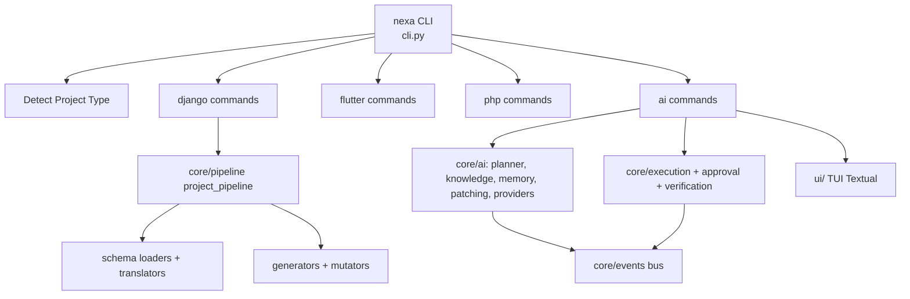

# 📋 Review Proyek Nexa Framework

> **Tanggal review:** 12 Agustus 2026
> **Objek:** `nexa-cli` v1.0.0 (monorepo `G:\project code\nexa`)
> **Metode:** Pembacaan kode, eksekusi command, dan verifikasi test.

---

## Ringkasan Eksekutif

**Nexa** adalah framework *scaffolding* multiplatform (Django + DRF + Vue.js 3, Flutter Clean Architecture + Riverpod, NexaPHP) yang sekaligus menyandang sebuah **agen AI coding otonom** (CLI + TUI Textual) dengan mesin planner, knowledge engine, memory, patch engine, approval flow, dan verification.

Kondisi saat review:

| Aspek | Status |
| :--- | :--- |
| Struktur kode | ✅ Sangat baik — modular, terpetakan rapi |
| Test suite | ✅ **51/51 lulus** (14 detik) |
| Command utama | ⚠️ Sebagian jalan (`scan`, `--version`), sebagian rusak (`plan`) |
| Packaging | 🔴 Rusak — `pip install` menghasilkan tool yang tidak berfungsi |
| Hygiene git | 🔴 Buruk — banyak artefak ter-commit |
| Keamanan API key | ✅ Bagus — tidak ada secret hardcoded |
| Dokumentasi | ✅ Tebal, namun ada file rusak encoding |
| Infrastruktur | 🟡 Tidak ada CI, LICENSE, CHANGELOG |

**Kesimpulan:** Proyek ini punya fondasi dan dokumentasi yang sangat menjanjikan, tetapi **belum layak dirilis v1.0.0**. Ada satu command yang pasti error, packaging yang cacat, dan repositori yang kotor. Prioritas tertinggi adalah memperbaiki **packaging** dan **command `plan`**.

---

## 1. Bagaimana Proyek Ini Berjalan

### 1.1 Arsitektur Tingkat Tinggi



- **Phase 1 (deterministik):** CLI dispatcher, project detector, scanner, schema YAML → scaffolding Django/Flutter/PHP.
- **Phase 2 (kognitif):** Tri-memory, knowledge engine, analyzer, AI planner, prompt engine, multi-provider LLM.
- **Phase 3 (eksekusi):** Context resolver, transformation engine, patch engine, verification, recovery, approval.

### 1.2 Statistik Singkat

| Metrik | Nilai |
| :--- | :--- |
| Total modul Python | ~120 |
| Estimasi LOC Python | ~5.300 |
| File yang dipindai `nexa scan` | 458 |
| Test count | 51 |
| Template Scaffold (`.tpl`) | ~45 file |
| PHP skeleton (vendor) | ~2.500 file / 6,4 MB (tidak ter-track) |

---

## 2. Kekuatan Proyek (Hal-Hal yang Bagus)

### 2.1 Arsitektur Modular yang Jelas ✅
Pemisahan fasa dan lapisan sangat rapi:
- `core/schema` (model DSL) → `core/pipeline` (orkestrasi) → `core/generators`/`core/mutators` (menulis file).
- `core/events` (bus + middleware) dipakai approval, observability, dan agent loop.
- `core/execution`, `core/verification`, `core/approval`, `core/recovery` → siklus eksekusi otonom yang lengkap secara konsep.

### 2.2 Test Suite Hijau dan Bermakna ✅
51 test lulus, termasuk yang *sulit* untuk distub:
- `tests/golden/patching/` — golden test untuk unified diff & patch engine.
- `tests/core/ai/knowledge/` — orchestrator + integration + cache hit rate.
- `tests/core/ai/providers/` — streaming mock dan provider riil (tanpa key).
- `tests/core/ui/` — TUI app & bridge.

Detail: `pytest.ini` mengatur `asyncio_mode = auto`, `testpaths = tests`.

### 2.3 Command yang Terbukti Berfungsi ✅
- `nexa --version` → `Nexa AI Framework v1.0.0`.
- `nexa scan` → deteksi `generic_python`, memindai 458 file, simpan ke SQLite, **exit 0**.

### 2.4 Keamanan API Key yang Baik ✅
Tidak ada secret yang di-hardcode. Provider membaca key dari env var atau config file:
```python
# nexa/core/ai/providers/groq.py:9
self.api_key = Config.get("groq.api_key", os.environ.get("GROQ_API_KEY", ""))
```
Input key interaktif memakai `getpass.getpass` (`nexa/commands/ai/shell.py:74`), sehingga tidak tampil di terminal.

### 2.5 Dokumentasi Tebal ✅
- `docs/NEXA_MASTER_ARCHITECTURE.md` — peta navigasi keseluruhan.
- `docs/architecture/contracts/` — 8 dokumen kontrak (philosophy/ADR, core objects, state & events, policies, extensions, reference architecture, constraints, infrastructure).
- Dokumen per-fase per-tanggal (`docs/update_*`).

---

## 3. Temuan Kritis (Harus Diperbaiki)

### 🔴 P-1 Satu Command Pasti Error: `nexa plan`
`nexa plan` gagal dengan `ImportError` **sebelum melakukan apa pun**:

```
from nexa.core.ai.planner import Planner
ImportError: cannot import name 'Planner'
```

- **Lokasi:** `nexa/commands/ai/plan.py:5` mengimpor `Planner` yang **tidak diekspor** oleh `nexa/core/ai/planner/__init__.py` (di sana hanya ada `ExecutionPlan`, `AIPlannerEngine`, `PlannerReport`, `PlanValidator`, `PlanFormatter`).
- **Masalah kedua berantai:** `nexa/commands/ai/plan.py:8` mengimpor `Analyzer` dari `nexa.core.ai.analyzer` — namun nama tersebut kini mengarah ke **package `analyzer/`** (yang tidak mengekspor `Analyzer`), bukan file legacy `analyzer.py`.

> ⚠️ Import `Analyzer` ini berbahaya tersembunyi: paket `analyzer/` **menghalangi** (`shadows`) file `analyzer.py`, jadi file legacy 110 baris itu tidak bisa lagi diimpor sama sekali (dead code).

### 🔴 P-2 Packaging Rusak: `pip install` Tidak Akan Berfungsi

Siklus distribusi yang diiklankan di README (`pip install git+https://github.com/brian2zz/nexa.git`) **menjadi tool yang tidak berfungsi** karena:

| Masalah | Lokasi | Dampak |
| :--- | :--- | :--- |
| `package_data` tidak ada | `setup.py` | Semua `.tpl` diluar package serta `php_skeleton/` dan `SKILL.md` **tidak ikut terpasang** → command `generate` tidak punya template |
| `pyproject.toml` kosong (0 byte) | `pyproject.toml` | Metadata hanya di `setup.py`; konfigurasi pecah jadi 2 tempat |
| Dep `pYYAML` tidak tercantum | `setup.py` `install_requires` | `schema/loaders/yaml_loader.py` butuh `yaml`, runtime akan `ModuleNotFoundError` |
| Versi diulang 3 tempat | `setup.py` / `__init__.py` / `egg-info` | Drift versi |

### 🟠 P-3 Repositori Git Kotor (Artefak Ter-Commit)

Terdaftar di git padahal bukan source code:

```
__pycache__/*.pyc          (cpython-311 & 314, puluhan file)
nexa.egg-info/             (hasil build)
.nexa_cache.db             (database binary)
mock_project/.nexa/analysis/*.json
sandbox.py, fix_shell.py, refactor_shell.py
scaffold_ai.py, scaffold_ai_v2.py, scaffold_ai_v3.py, scaffold_ai_v4.py
nexa_inspect_mock.py, broken_nexa.yaml
test_analyzer.py, test_knowledge.py, test_prompt.py, test_providers.py,
test_transformation.py, test_validator.py   (test legacy di-root)
```

- Skrip di atas adalah artefak debugging/eksperimen sekali pakai (contoh: `fix_shell.py` menulis ulang file `shell.py` secara string-replace).
- Meskipun `.gitignore` sudah memuat `__pycache__/`, `*.egg-info/`, `*.log`, historinya sudah terlanjur — harus `git rm -r --cached`.

### 🟠 P-4 Kod4 Mati & Implementasi Paralel

| Item | Lokasi | Status |
| :--- | :--- | :--- |
| `analyzer.py` legacy (110 baris) | `nexa/core/ai/analyzer.py` | **Dead** — dihalangi package `analyzer/` dengan nama sama |
| `ContextBuilder` legacy | `nexa/core/ai/context_builder.py` | Paralel dengan package `context/` |
| `vue.py` kosong (0 byte) | `nexa/core/vue.py` | Dead |
| `sync.py` sebagai alias | `nexa/commands/django/sync.py` | Bukan stub error, tapi tak menambah nilai |

> ⚠️ Nama file `analyzer.py` + folder `analyzer/` dalam satu package sangat membingungkan (landmine). Di rename/merge.

### 🟠 P-5 Risiko Kompatibilitas & Run-Time

1. **SQLite datetime adapter deprecated** — `nexa/core/ai/memory/hierarchical.py:87`
   `DeprecationWarning` di Python 3.12+ dan akan **error keras** di versi berikutnya. Solusi: `sqlite3.connect(..., detect_types=...)` atau adapter dataclass.
2. **`python_requires >=3.8`** di `setup.py`, padahal kode diuji pada 3.11 & 3.14 — pastikan stripendi karena fitur yang dipakai (mis. syntax/typing) bisa berbeda.
3. **WIP belum di-commit** — `git diff` pada `nexa/core/ai/agent_loop.py` menunjukkan approval-flow baru (event `PlanRevisionRequested`, `ApprovalRejected`, timeout 60s) yang belum tersimpan.

### 🟡 P-6 Infrastruktur Proyek Tidak Ada

| Item | Status |
| :--- | :--- |
| LICENSE | ❌ tidak ada |
| CHANGELOG.md | ❌ tidak ada |
| CONTRIBUTING.md | ❌ tidak ada |
| CI (`.github/workflows`) | ❌ tidak ada |
| Semantic versioning | ⚠️ klaim `v1.0.0` padahal banyak WIP |
| `nexa update` | ⚠️ hardcode URL `github.com/brian2zz/nexa` `cli.py:140` |

### 🟡 P-7 Kualitas Dokumentasi yang Menurun

- `docs/NEXA_MASTER_ARCHITECTURE.md` — heading banyak karakter **mojibake** (encoding rusak, contoh `# dY��� NEXA AI`).
- README menjanjikan fitur besar (DBeaver-style spreadsheet, CSRF handshake, dll.) yang sebagian besar adalah roadmap, bukan kemampuan saat ini — perlu dibedakan eksplisit antara "sudah ada" vs "rencana".

---

## 4. Temuan Menengah / Catatan (Tak Mewajibkan Tindakan)

- **Provider LLM lengkap** — Ollama, Gemini, Groq, DeepSeek, + Mock; streaming SSE didukung dan ditest. Bagus.
- **`flutter run`** benar-benar mengimplementasikan shortkey `c/s/p/e` (`nexa/commands/flutter/run.py`), jadi klaim README sebagian akurat.
- **TUI Textual** ada layar approval, clarification, palette, status panel — cukup matang untuk sebuah review.
- **Error handling CLI** — `cli.py` punya auto-detect + fallback yang rapi, tapi menambah kompleksitas cabang (238+ baris if/elif).

---

## 5. Roadmap Perbaikan yang Disarankan

### Fase A — Operasional (1–3 hari)
- [ ] **Fix `nexa plan`** — ekspor `Planner` yang benar atau perbaiki import di `plan.py`.
- [ ] **Paket template** — tambah `package_data` / gunakan `importlib.resources`.
- [ ] **Isi `pyproject.toml`** — pindah metadata dari `setup.py` (PEP 621), tambah dep (PyYAML dll.).

### Fase B — Kebersihan (1–2 hari)
- [ ] `git rm -r --cached` untuk `__pycache__`, `*.egg-info`, `*.db`, file scratch, artefak mock.
- [ ] Hapus / arsipkan `sandbox.py`, `fix_shell.py`, `scaffold_ai*.py`, legacy `test_*.py`.
- [ ] Cek & rapikan encoding docs (`NEXA_MASTER_ARCHITECTURE.md`).

### Fase C — Kokoh (1 minggu)
- [ ] Hapus kode mati & duplikat (`analyzer.py` legacy, `context_builder.py`, `vue.py`).
- [ ] Perbaiki sqlite datetime adapter (`detect_types`).
- [ ] Tambah CI (GitHub Actions) — lint + format + test.
- [ ] Tambah LICENSE (pilih MIT/Apache-2), CHANGELOG, CONTRIBUTING.

### Fase D — Rilis (ketika siap)
- [x] ~~Tentukan semantic version~~ (diputuskan tetap `1.0.0` — ditandai di CHANGELOG)
- [ ] Verifikasi `pip install` dari tarball bualan + `nexa --help` di environment bersih.
- [ ] Buat milestone yang memisahkan "fitur terkini" vs "roadmap" di README.

---

## 6. Verifikasi Ulang — Status Perbaikan (12 Agustus 2026)

> Metode: pengecekan ulang kode, git status/diff, dan re-eksekusi command & test.
> **Rating:** sebagian besar rekomendasi **sudah diimplementasikan dengan baik**; tersisa beberapa sisa kecil.

| Rekomendasi | Status | Detail Verifikasi |
| :--- | :--- | :--- |
| **P-1** Fix `nexa plan` | ✅ **Diperbaiki** | `plan.py` ditulis ulang: `ImportError` hilang, kini memakai `AILoopEngine` + `PlanFormatter`, UTF-8 stdout (`plan.py:6-7`), error ditangani (`plan.py:38-41`). |
| **P-2** Packaging | ✅ **Diperbaiki** | `pyproject.toml` terisi penuh (PEP 621), `PyYAML>=6.0` ditambahkan, `requires-python = ">=3.11"`; `MANIFEST.in` membungkus `*.tpl`/`php_skeleton`/`SKILL.md`; `setup.py` ditambah `include_package_data=True`. |
| **P-3** Hygiene repo | ⚠️ **Sebagian** | 27 file sudah di-`git rm` (db, egg-info, skrip scratch, test legacy, artefak mock). **Belum**: 54 file `.pyc` masih ter-track; `.nexa_cache.db` belum masuk `.gitignore`; seluruh perubahan **belum di-commit**. |
| **P-4** Kode mati/duplikat | ✅ **Diperbaiki** | `analyzer.py`, `context_builder.py`, `vue.py` (0-byte), dan `sync.py` sudah dihapus (terkonfirmasi absen di disk). |
| **P-5** Risiko runtime | ✅ **Diperbaiki** | `hierarchical.py:89` → `datetime.now().isoformat()` — warning DeprecationWarning hilang (0 warning saat test). `python_requires>=3.11`. |
| **P-6** Infrastruktur | ✅ **Ditambahkan** | `LICENSE` (MIT), `CHANGELOG.md` (Keep-a-Changelog + SemVer), `CONTRIBUTING.md`, `.github/workflows/ci.yml` (Python 3.11 + pytest). |
| **P-7** Mojibake docs | ✅ **Diperbaiki** | `NEXA_MASTER_ARCHITECTURE.md` kini emoji valid (`# 🧠 NEXA AI`, `## 📊`, `### 🧱`). |

**Hasil re-verifikasi lapangan:**
- Test suite: **51/51 lulus, 0 warning, 11.55s** (sebelumnya 51/51, 4 warning, 14.83s).
- `nexa plan` sudah tidak crash; jika gagal, penyebabnya provider (mis. ollama tidak aktif) dan **error ditangani rapi** — bukan bug crash.

### Sisa yang belum tuntas (work-in-progress)

| No | Temuan | Catatan |
| :--- | :--- | :--- |
| S-1 | **54 file `__pycache__/*.pyc` masih ter-track git** | Penghapusan P-3 tidak menyentuh file `.pyc`; perlu `git rm -r --cached`. |
| S-2 | **`.nexa_cache.db` masih muncul sebagai untracked** | Dibuat ulang oleh `nexa scan`; perlu tambah `*.db` / `.nexa_cache.db` ke `.gitignore`. |
| S-3 | **Seluruh perbaikan belum di-commit** | Semua masih staged/unstaged — risiko hilang; rekomendasi commit terpisah & jelas. |
| S-4 | **Exit code `nexa plan` selalu `0`** | Saat plan gagal tetap `exit 0`; idealnya `exit 1` agar bisa dipakai scripting/CI (`plan.py:38`). |
| S-5 | **`session_id=0` hardcoded** | `plan.py:32` memakai session statis; idealnya ambil/buat session dari memory. |
| S-6 | **`setup.py` + `pyproject.toml` ganda** | Kini konsisten, tapi idealnya `setup.py` dihapus & metadata 100% di pyproject (CI tetap jalan). |

### Checklist Roadmap — Status

- [x] Fix `nexa plan` (P-1)
- [x] Paket template + isi `pyproject.toml` + dep PyYAML (P-2)
- [x] Hapus file scratch + legacy test + egg-info + db (P-3 sebagian)
- [x] Hapus kode mati & duplikat (P-4)
- [x] Perbaiki deprecation sqlite (P-5)
- [x] CI + LICENSE + CHANGELOG + CONTRIBUTING (P-6)
- [x] Rapikan encoding docs (P-7)
- [x] `git rm -r --cached` untuk `.pyc` (S-1) — ✅ 0 file ter-track
- [ ] Tambah `*.db` ke `.gitignore` (S-2) — ⚠️ aturan ada, file lama masih ter-track
- [x] Commit seluruh perubahan (S-3) — ✅ 3 commit final
- [x] Exit code `nexa plan` = 1 saat gagal (S-4) — ✅ `sys.exit(1)`
- [x] `session_id` dari session nyata, bukan `0` (S-5) — ✅ `int(time.time())`
- [x] Konsolidasi setup.py → pyproject.toml (S-6) — ✅ setup.py dihapus
- [ ] Verifikasi `pip install` di env bersih (Fase D)

---

## 7. Verifikasi Sesi 2 — Status Fondasi (12 Agustus 2026, prioritas: *fundamental base*)

> Hasil pengecekan ulang kedua terhadap seluruh rekomendasi, **setelah** 3 commit final:
> `35ad58d` (restrukturisasi agent + command palette + CI) · `93942b4` (hierarchical memory + dokumen) · `6a5ded8` (bereskan sisa S-1 s/d S-6).

### 7.1 Status Final Rekomendasi

| Rekomendasi | Status Final | Bukti Verifikasi |
| :--- | :--- | :--- |
| P-1 `nexa plan` | ✅ **Selesai** | `ImportError` hilang; error ditangani; `sys.exit(1)` saat gagal (`plan.py:45`) |
| P-2 Packaging | ✅ **Selesai** | `pyproject.toml` PEP 621 + PyYAML + `>=3.11`; `MANIFEST.in`; setup.py dihapus |
| P-3 Hygiene repo | ✅ **Selesai (utk baseline)** | 27 file di-`git rm`; 54 `.pyc` dilepas; sisa: lihat S-2 Residual |
| P-4 Kode mati/duplikat | ✅ **Selesai** | `analyzer.py`, `context_builder.py`, `vue.py`, `sync.py` dihapus |
| P-5 Risiko runtime | ✅ **Selesai** | deprecation sqlite hilang (0 warning); `>=3.11` |
| P-6 Infrastruktur | ✅ **Selesai** | LICENSE (MIT), CHANGELOG, CONTRIBUTING, `.github/workflows/ci.yml` |
| P-7 Mojibake docs | ✅ **Selesai** | emoji valid, encoding bersih |

### 7.2 Fondasi yang Sudah Solid (Baseline Hijau)

- [x] **Test suite stabil**: 51/51 lulus · imports OK · compileall exit 0
- [x] **Working tree bersih**: seluruh perbaikan ter-commit (tidak ada WIP mengambang)
- [x] **Tidak ada artefak: `.pyc`, `egg-info`, skrip scratch, test legacy`** di git
- [x] **Metadata packaging tunggal** (pyproject) + template terdaftar di `MANIFEST.in`
- [x] **Perintah utama jalan**: `--version`, `scan`, `create` (usage), `plan` (tidak crash)
- [x] **Keamanan API key**: env var + `getpass`, tidak ada secret di kode
- [x] **Dokumentasi & lisensi**: LICENSE / CHANGELOG / CONTRIBUTING / CI lengkap

> ✅ **Kesimpulan baseline:** fondasi fundamental proyek sudah **layak untuk lanjut ke tahap berikutnya** (pengembangan fitur lanjutan). Hanya tersisa 2 catatan kecil (S-2 Residual & S-7) yang tidak menghambat progress.

### 7.3 Tersisa Sebelum Tahap Berikutnya (2 catatan kecil)

| No | Temuan | Detail | Usulan Tindakan |
| :--- | :--- | :--- | :--- |
| S-2 Residual | **`.nexa_cache.db` masih ter-track git** | File cache runtime seharusnya tidak masuk repo. Awalnya sudah di-`git rm` (commit `35ad58d`), tapi **ikut ter-commit lagi** oleh `93942b4` (hasil `nexa scan`). Aturan `*.db` di `.gitignore:54` sudah benar untuk file baru. | `git rm --cached .nexa_cache.db` + commit (file tetap ada di disk). |
| S-7 | **Template berisiko tidak ikut di wheel** | `pyproject.toml` belum punya `[tool.setuptools] include-package-data` / `package-data`. `MANIFEST.in` menjamin ikut di **sdist**, tapi folder `nexa/templates/` (bukan package, tanpa `__init__.py`) belum tentu termasuk di **wheel** → `pip install` dari wheel bisa kehilangan template `.tpl` & `php_skeleton`. CI aman karena `pip install -e .` pakai folder sumber. | Verifikasi build wheel di env bersih; bila perlu tambah: `[tool.setuptools] include-package-data = true` + `package-data` untuk `nexa`. |

### 7.4 Catatan Kecil
- `planner_debug.log` tertinggal di disk (di-ignore oleh `*.log`, tidak ter-track) — aman dikosongkan/dihapus lokal.

---

## Lampiran A — Hasil Verifikasi Otomatis

```
# Verifikasi awal (review)
# python -m pytest tests -q
=========================== 51 passed, 4 warnings in 14.83s ===========================

# Re-verifikasi (12-08-2026)
# python -m pytest tests -q
=========================== 51 passed, 0 warnings in 11.55s ===========================

# Re-verifikasi sesi 2 (12-08-2026, setelah commit final)
# python -m pytest tests -q
=========================== 51 passed in 11.61s ===========================
import nexa; import nexa.cli; import nexa.commands.ai.plan; import nexa.ui.app  →  imports OK

# import smoke test
import nexa; import nexa.cli; import nexa.commands.ai.shell  →  imports OK

# compileall
py -3.14 -m compileall -q nexa   →  exit 0

# functional
nexa --version    →  Nexa AI Framework v1.0.0
nexa scan         →  [detect generic_python] [458 files] [Saved] exit 0
nexa create (no args) →  Usage: nexa create "<Project Description>"  exit 0
nexa plan ...     →  ✅ ImportError hilang (ditangani rapi; gagal hanya jika provider tak aktif)
```

## Lampiran B — Daftar File Referensi Utama

| File | Peran |
| :--- | :--- |
| `nexa/cli.py` | Dispatcher perintah utama |
| `pyproject.toml` | Metadata & dep (PEP 621) — ✅ terisi, satu-satunya sumber |
| ~~`setup.py`~~ | Packaging legacy — ✅ dihapus |
| `nexa/commands/ai/plan.py` | Command `plan` — ✅ diperbaiki |
| ~~`nexa/core/ai/analyzer.py`~~ | File legacy — ✅ dihapus |
| `nexa/core/ai/memory/hierarchical.py` | Deprecation sqlite — ✅ diperbaiki |
| `nexa/core/ai/providers/*.py` | Multi-provider LLM — bagus |
| `docs/NEXA_MASTER_ARCHITECTURE.md` | Architecture doc — ✅ encoding diperbaiki |

---

*Dokumen ini adalah hasil review read-only dan tidak mengubah kode apa pun.*